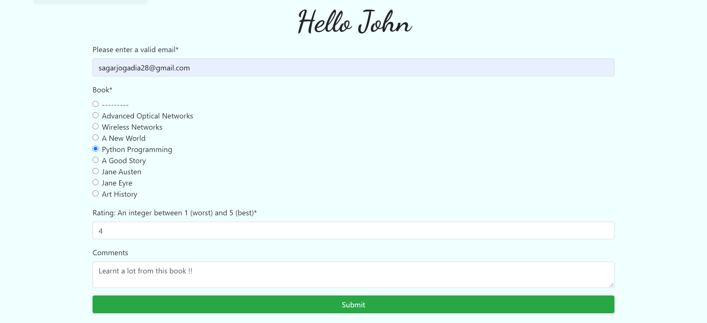

# About the Project

Library Management Web Application built using Python - Django, HTML5, CSS3, Bootstrap, and SQLite. Users can create new account or login using existing one. After login, users can purchase, borrow, review books and manage their lists in their dashboards.

# Technologies Used

- [Python](https://www.python.org/)
- [Django](https://www.djangoproject.com/)
- [HTML5](https://developer.mozilla.org/en-US/docs/Web/Guide/HTML/HTML5)
- [CSS3](https://developer.mozilla.org/en-US/docs/Archive/CSS3)
- [Bootstrap](https://getbootstrap.com/)
- [SQLite](https://www.sqlite.org/)

# Setup

- Install PyCharm and setup a python development environment including python, PIP, Virtualenv.
- Run the Django migrations to setup your models.
- Run the project in PyCharm and go to http://127.0.0.1:8000/
- Running the admin Console: To create a super user you need to define a user name and password
- Go to admin portal: http://127.0.0.1:8000/admin
- Login to the admin site using the username and password you used.
- Go to http://127.0.0.1:8000/myapp/

# Screenshots

